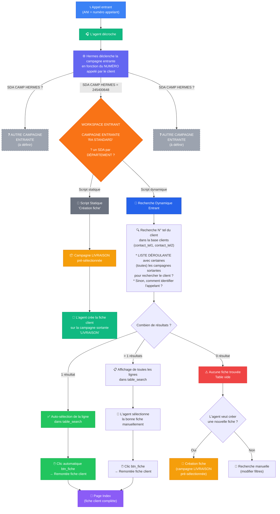
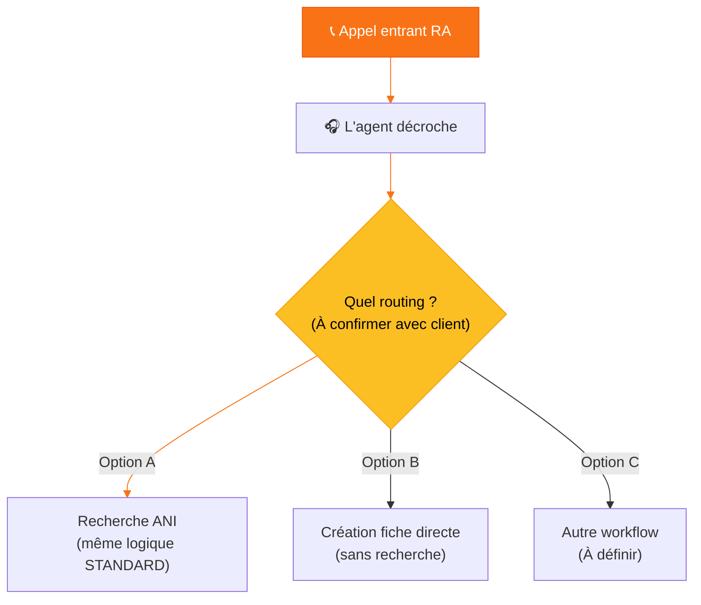

# Workflow Campagnes Entrantes - VISTALID / Hermes 360

---

## 1. Campagne STANDARD (DID 245400648)

> Tables : `CL_STANDARD` / `C2_STANDARD`
> Script dynamique — l'agent reçoit un appel entrant

---

## 2. Campagne Réceptionne Appels RA

> À définir avec le client — questions ci-dessous

---

## 3. Questions à poser au client

### Campagne STANDARD

| # | Question                                                                                     | Options possibles                                                                                                                                   |
| - | -------------------------------------------------------------------------------------------- | --------------------------------------------------------------------------------------------------------------------------------------------------- |
| 1 | **Comment l'agent doit trouver l'appelant ?**                                          | a) Recherche auto par N° téléphone de l'appelant (ANI) dans toutes les campagnes ` `b) Recherche par département ` `c) Autre critère |
| 2 | **Si le N° est trouvé dans 1 seule campagne** → remontée automatique de la fiche ? | Oui / Non                                                                                                                                           |
| 3 | **Si le N° est trouvé dans plusieurs campagnes** → l'agent choisit manuellement ?   | Oui / Non                                                                                                                                           |
| 4 | **Si le N° n'est pas trouvé** → que fait l'agent ?                                  | a) On remonte la fiche client dans la campagne entrante ? ` `b) On crée une nouvelle fiche dans la campagne sortante LIVRAISON ? ` `c) Autres options ?                                   |
| 5 | **Quelles campagnes sortantes doivent être disponibles pour la recherche ?**          | Campagne LIVRAISON, autres ?                                                                                                                        |

