# Workflow Campagnes Entrantes - VISTALID / Hermes 360

---

## 1. Campagne STANDARD (DID 245400648)

> Tables : `CL_STANDARD` / `C2_STANDARD`
> Script dynamique — l'agent reçoit un appel entrant

```mermaid
flowchart TD
    A["📞 Appel entrant\n(ANI = numéro appelant)"] --> B["🎧 L'agent décroche"]
    B --> C["⚙️ Hermes déclenche la campagne entrante\nen fonction du NUMÉRO appelé par le client"]

    C -->|"SDA CAMP HERMES ?"| X1["❓ AUTRE CAMPAGNE\nENTRANTE\n(à définir)"]
    C -->|"SDA CAMP HERMES = 245400648"| D{"WORKSPACE ENTRANT\n\n CAMPAGNE ENTRANTE 'RA STANDARD' \n\n? un SDA par DÉPARTEMENT ?"}
    C -->|"SDA CAMP HERMES ?"| X2["❓ AUTRE CAMPAGNE\nENTRANTE\n(à définir)"]

    D -->|"Script dynamique"| E["📄 Recherche Dynamique Entrant"]
    D -->|"Script statique"| F["📝 Script Statique\n'Création fiche'"]

    F --> F1["📦 Campagne LIVRAISON\npré-sélectionnée"]
    F1 --> F2["👤 L'agent crée la fiche client\nsur la campagne sortante\n'LIVRAISON'"]

    E --> G["🔍 Recherche N° tel du client\ndans la base clients\n(contact_tel1, contact_tel2)\n\n* LISTE DÉROULANTE avec certaines\n(toutes) les campagnes sortantes\npour rechercher le client ?\n* Sinon, comment identifier l'appelant ?"]

    G --> H{"Combien de résultats ?"}

    H -->|"1 résultat"| I["✅ Auto-sélection de la ligne\ndans table_search"]
    I --> J["🖱️ Clic automatique btn_fiche\n→ Remontée fiche client"]

    H -->|"> 1 résultats"| K["📋 Affichage de toutes les lignes\ndans table_search"]
    K --> L["👤 L'agent sélectionne\nla bonne fiche manuellement"]
    L --> M["🖱️ Clic btn_fiche\n→ Remontée fiche client"]

    H -->|"0 résultat"| N["⚠️ Aucune fiche trouvée\nTable vide"]
    N --> O{"L'agent veut créer\nune nouvelle fiche ?"}
    O -->|Oui| P["📝 Création fiche\n(campagne LIVRAISON\npré-sélectionnée)"]
    O -->|Non| Q["🔄 Recherche manuelle\n(modifier filtres)"]

    J --> R["📂 Page Index\n(fiche client complète)"]
    M --> R

    style A fill:#3b82f6,color:#fff,stroke:#1d4ed8
    style B fill:#10b981,color:#fff,stroke:#059669
    style C fill:#6366f1,color:#fff,stroke:#4f46e5
    style X1 fill:#9ca3af,color:#fff,stroke:#6b7280,stroke-dasharray: 5 5
    style X2 fill:#9ca3af,color:#fff,stroke:#6b7280,stroke-dasharray: 5 5
    style D fill:#f97316,color:#fff,stroke:#ea580c
    style E fill:#2563eb,color:#fff,stroke:#1e40af
    style F fill:#6b7280,color:#fff,stroke:#4b5563
    style F1 fill:#f59e0b,color:#fff,stroke:#d97706
    style F2 fill:#10b981,color:#fff,stroke:#059669
    style I fill:#22c55e,color:#fff,stroke:#16a34a
    style J fill:#22c55e,color:#fff,stroke:#16a34a
    style N fill:#ef4444,color:#fff,stroke:#dc2626
    style P fill:#f59e0b,color:#fff,stroke:#d97706
    style R fill:#8b5cf6,color:#fff,stroke:#7c3aed
```

---

## 2. Campagne Réceptionne Appels RA

> À définir avec le client — questions ci-dessous

```mermaid
flowchart TD
    A["📞 Appel entrant RA"] --> B["🎧 L'agent décroche"]
    B --> D{"Quel routing ?\n(À confirmer avec client)"}

    D -->|"Option A"| E["Recherche ANI\n(même logique STANDARD)"]
    D -->|"Option B"| F["Création fiche directe\n(sans recherche)"]
    D -->|"Option C"| G["Autre workflow\n(À définir)"]

    style A fill:#f97316,color:#fff,stroke:#ea580c
    style D fill:#fbbf24,color:#000,stroke:#f59e0b

    linkStyle 0 stroke:#f97316
    linkStyle 1 stroke:#f97316
    linkStyle 2 stroke:#f97316
```

---

## 3. Questions à poser au client

### Campagne STANDARD

| # | Question                                                                                     | Options possibles                                                                                                                                   |
| - | -------------------------------------------------------------------------------------------- | --------------------------------------------------------------------------------------------------------------------------------------------------- |
| 1 | **Comment l'agent doit trouver l'appelant ?**                                          | a) Recherche auto par N° téléphone de l'appelant (ANI) dans toutes les campagnes ` `b) Recherche par département ` `c) Autre critère |
| 2 | **Si le N° est trouvé dans 1 seule campagne** → remontée automatique de la fiche ? | Oui / Non                                                                                                                                           |
| 3 | **Si le N° est trouvé dans plusieurs campagnes** → l'agent choisit manuellement ?   | Oui / Non                                                                                                                                           |
| 4 | **Si le N° n'est pas trouvé** → que fait l'agent ?                                  | a) On remonte la fiche client dans la campagne entrante ? ` `b) On crée une nouvelle fiche dans la campagne sortante LIVRAISON ? ` `c) Autres options ?                                   |
| 5 | **Quelles campagnes sortantes doivent être disponibles pour la recherche ?**          | Campagne LIVRAISON, autres ?                                                                                                                        |

